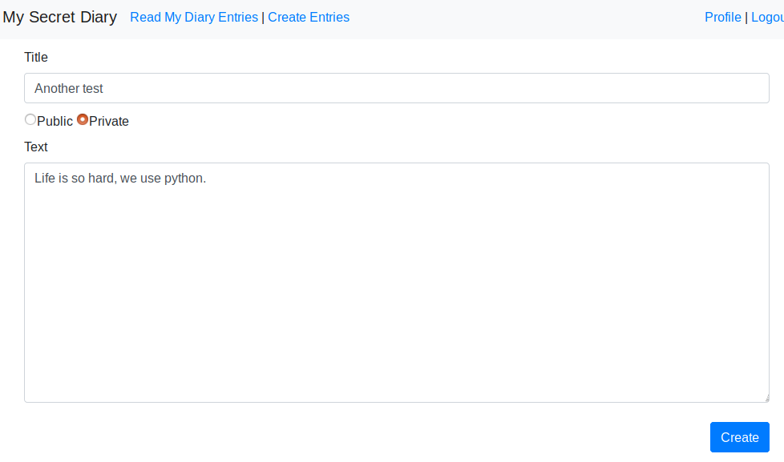
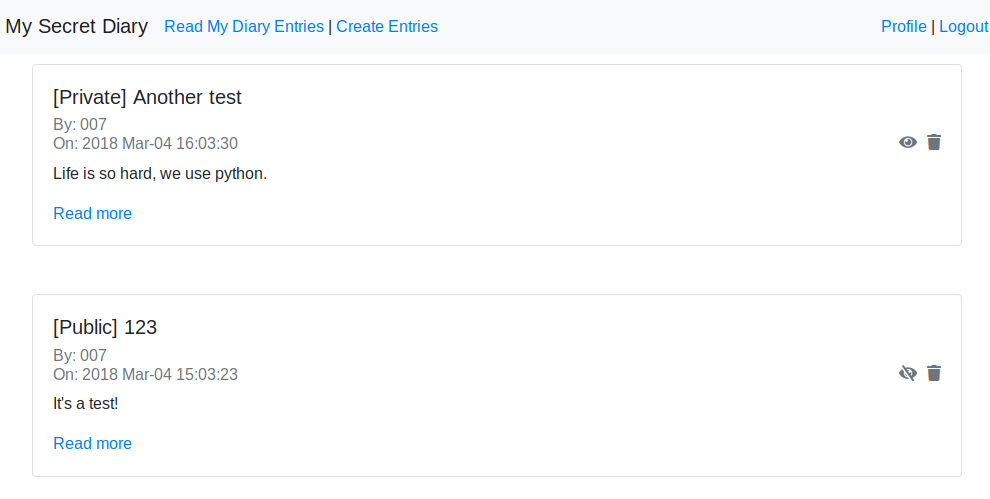
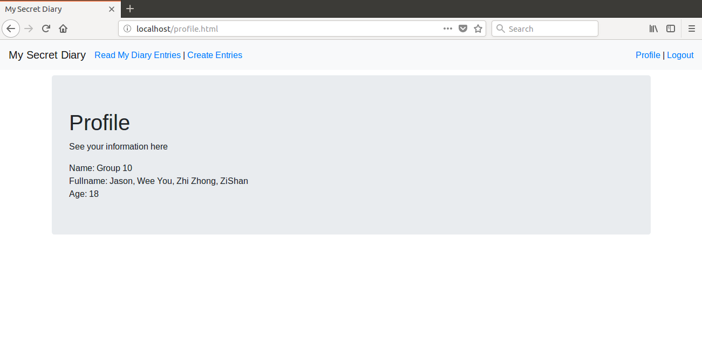
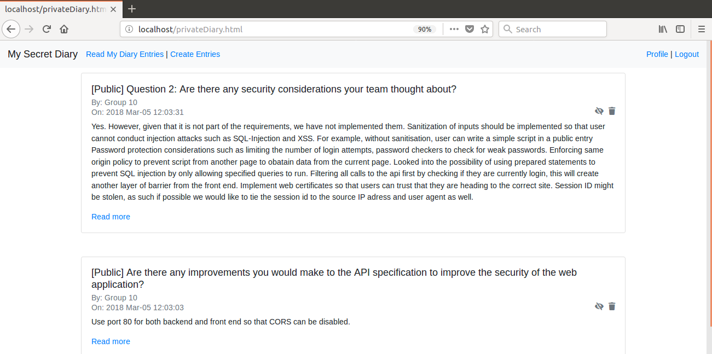

# rest-api-development

CS5331 Assignment 1 Project Reference Repository

## Team Members

1. LAU Wee You
2. LEE Zi Shan
3. SIA Wei Kiat Jason
4. ZHOU Zhi Zhong

## Short Answer Questions

### Question 1: Briefly describe the web technology stack used in your implementation.

The application uses Python-Flask to handle requests to the back-end. The code in the Python-Flask will then modify our database using SQLite3. 

On the UI, we use javascript to asynchronously call our RESTful API and modify our HTML accordingly.

*****
### Question 2: Are there any security considerations your team thought about?

Yes. However, given that it is not part of the requirements, we have not implemented them. 

Sanitization of inputs should be implemented so that user cannot conduct injection attacks such as SQL-Injection and XSS. For example, without sanitisation, user can write a simple script in a public entry

Password protection considerations such as limiting the number of login attempts, password checkers to check for weak passwords. 

Enforcing same origin policy to prevent script from another page to obatain data from the current page.

Looked into the possibility of using prepared statements to prevent SQL injection by only allowing specified queries to run. 

Filtering all calls to the api first by checking if they are currently login, this will create another layer of barrier from the front end.

Implement web certificates so that users can trust that they are heading to the correct site.

Session ID might be stolen, as such if possible we would like to tie the session id to the source IP adress and user agent as well. 
 
*****
### Question 3: Are there any improvements you would make to the API specification to improve the security of the web application?

Use port 80 for both backend and front end so that CORS can be disabled.

****
### Question 4: Are there any additional features you would like to highlight?

1) We provide a friendly way to show the diary page, `read more` has a card window to display this diary. modify diary permission and delete personal diaries. Inside `Read My Diary Entries`, we can switch the permission between `public` and `private` through `eye` icon, and delete the page from `delete` icon.

****
### Question 5: Is your web application vulnerable? If yes, how and why? If not, what measures did you take to secure it?

Yes, the web application is vulnerable. 
1) There is a chance of leaked session ID. Hence to be more defensive, We store session data such as token on the server side in our Users table. Every login, we will generate a new token and this token will be tagged to the current user for the particular session. For every re-login, we will generate a new token.
 
2) There is a chance of XSS attack. In our create diary entry page, we placed a script within the Text field such as "<Script>Alert('hello')</ Script>" and we created the diary post, the script was also run.  One possible measure is to do a sanity check on what are the inputs being passed from the user to ensure that there are no scripts. Enabling content security policy might help by using a HTTP header to provide a whitelist of sources of trusted content and allow rendering of resources from these sources. In addition there is a possibility of token being stolen due to XSS attacks.

3) There is a possibility of CSRF attack where the attacker send a forged request on behalf of the victim. In the case of the diary application, a possibile scenario would be the attacker send a request to see the victim's private diary requests or do a public post on behalf of the victim. To increase defense against this, we can do a HTTP referrer validation. By checking the header, we will be able to see if the request is from the same site or cross site, giving the server a better understanding of which site is making the request. 

4) The current application is also susceptible to eavesdropping, as such we can implement HTTPS to prevent man in the middle attack.

5) Prone to DOS attack, we can implement some services to hold any request from the particlar IP if there is an unusual amount of request from them.

6) Brute force attack, we should deny the user from logging in if they have key in more than 3 times of wrong password combination.

### Feedback: Is there any other feedback you would like to give?
- Assignment could have been more security focused (For example, given a existing secret diary, implement XXX security features).

## Declaration

### Please declare your individual contributions to the assignment:

1. LAU Wee You
    - Docker requirements, implementing database, skeleton codes, debugging
2. LEE Zi Shan
    - Linking front-end and back-end (diary), back-end (diary)
3. SIA Wei Kiat Jason
    - Front-end design and implementation, Database Design
4. ZHOU Zhi Zhong
    - Linking front-end and back-end (users), back-end (users)

## Screenshots

